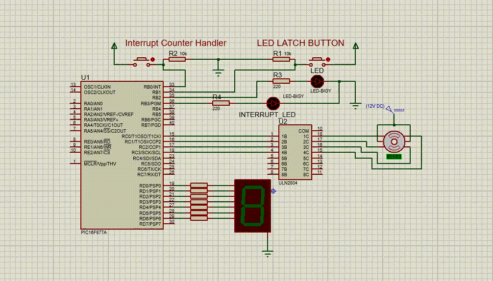
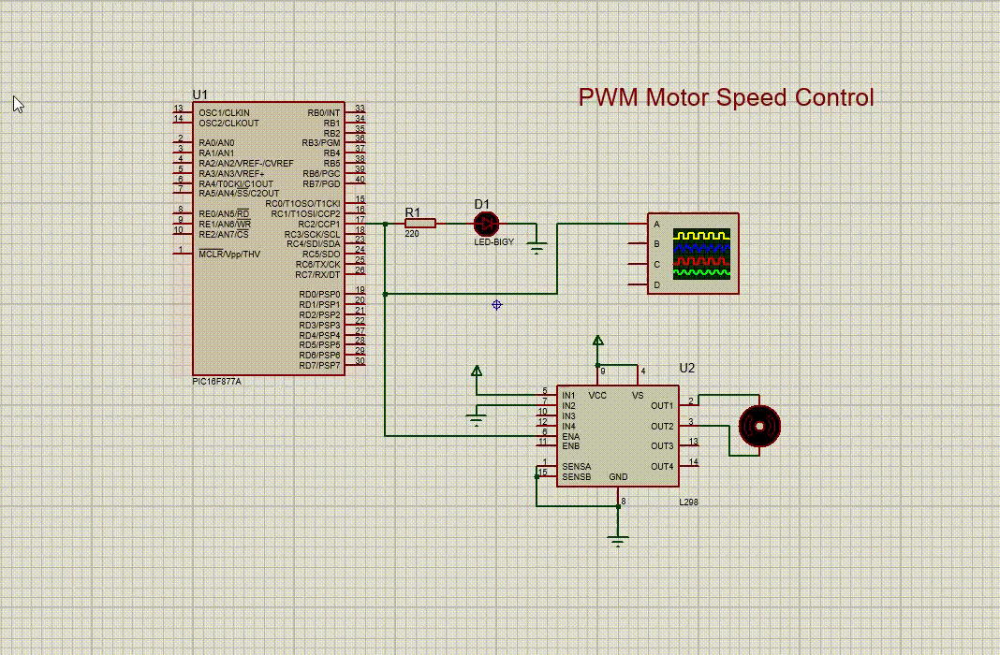

# Embedded-Systems   
Embedded Systems | Interfacing and Device Drivers

<h3 align=center>Interrrupt & Interfacing</h3>

<h3 align=center>PWM Motor Speed Control</h3>

# Requirements   
OS: Windows, Linux   
Hardware:   PIC16F877A   
Compiler:   XC8   
IDE:        MPLAB   
Simulation: Proteus-8   

# Table of Content:   
  - Interfacing Drivers
    - 7-Segment
    - Stepper Motor
    - DC Motor
    - Ultrasonic sensor
  - Interrupt Handling
  - Timers
  - Counters
  - CCP Module Capture/Compare/PWM
    - LED Dimmer
    - Motor Speed Control
    
